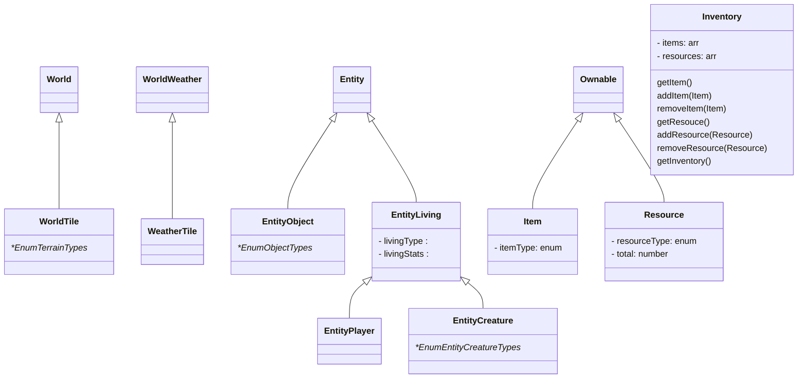
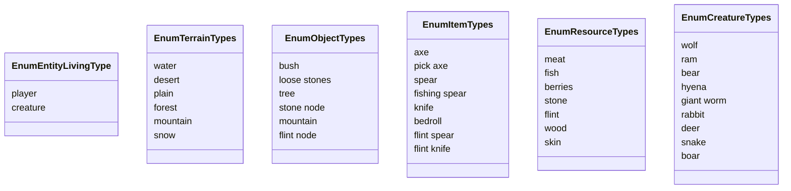

# exothium-world
Exothium World Game Repository

# Game Spec
#exothium #ExoWorld #spec 

## #todo
 - [ ] create diagram of relationships
 - [ ] falta definir totalmente:
	 - [ ] EntityLiving 
	 - [ ] Loot
 - [ ] stats that entityLiving will need

## Classes

- World 
- WorldTile
- WorldWeather
- WeatherTile
- Entity
	- EntityObject
	- EntityLiving
		- EntityPlayer
		- EntityCreature
- Interaction
- Ownable
	- item
	- resource
- Loot

- World 
- WorldTile
- WorldWeather
- WeatherTile
- Entity
	- EntityObject
	- EntityLiving
		- EntityPlayer
		- EntityCreature
- Interaction
- Ownable
	- item
	- resource
- Loot

## Enums
- TerrainTypes
- ObjectTypes
- LivingTypes
- CreatureTypes
- ItemsTypes
- ResourceTypes

## Enums
- TerrainTypes
- ObjectTypes
- LivingTypes
- CreatureTypes
- ItemsTypes
- ResourceTypes

### TerrainsTypes:
- water
- desert
- plain
- forest
- mountain
- snow

### ObjectTypes:
1. bush
2. loose stones
3. tree
4. stone node
5. flint node

### LivingTypes:
1. player
2. creature

### CreatureTypes:
1. Wolf
2. Ram
3. Bear
4. Hyena
5. Giant Worm
6. Rabbit
7. Deer
8. Snake
9. Boar

### ItemsTypes:
- Axe
- PickAxe
- Spear
- Fishing spear
- Knife
- Bedroll
- Flint Spear
- Flint Knife

### ResourceTypes
- Meat
- Fish
- Berries
- Stone
- Flint 
- Wood
- Skin

#### Notes:
Doubts:
using 1 felt for 2 integers

Ideas:
anyone can attack with a creature, if kills the player the game will collect their resources (spoils of war)

## Classes:

### World
|      name        |      type           |      params           |      return           | 
| ------------ | --------------- |--------------- |--------------- |
| terrainSeed | int256 |
| radius | int256 |
| getWorldTile | function | [q,r] | `WorldTile`

### WorldTile
|      name        |      type           |      params           |      return           | 
| ------------ | --------------- |--------------- |--------------- |
| type | `terrain` |
| livingEntities | arr[`EntityLiving`] | 
| objectEntities | arr[`EntityThing`] | 

### WorldWeather
|      name        |      type           |      params           |      return           | 
| ------------ | --------------- |--------------- |--------------- |
| weatherSeed | int256 |
| radius | int256 |
| getWeatherTile | function | [q,r] | `WeatherTile`

### WeatherTile
|      name        |      type           |      params           |      return           | 
| ------------ | --------------- |--------------- |--------------- |
| clouds | int [0->1] | 
| preasure | int [-1 -> -1] | 
| wind | int  [angle] | 
| temperature | int  [-50 -> 50] | 

### Entity ⚠️
|      name        |      type           |      params           |      return           | 
| ------------ | --------------- |--------------- |--------------- |
| location | [q,r] |
| isInteractive | bool |
| isInGame | bool |
| interactions | arr[`Interaction`] | 
| interact | interactions["action"] | 

### EntityObject ⚠️
|      name        |      type           |      params           |      return           | 
| ------------ | --------------- |--------------- |--------------- |
| type | `objectType` |

### EntityLiving ⚠️
|      name        |      type           |      params           |      return           | 
| ------------ | --------------- |--------------- |--------------- |
| type | `LivingType` |
| stats | `Stats` |

### EntityPlayer ⚠️
|      name        |      type           |      params           |      return           | 
| ------------ | --------------- |--------------- |--------------- |
| items | arr[`Item`] |
| stats | `Stats` |

### EntityCreature ⚠️
|      name        |      type           |      params           |      return           | 
| ------------ | --------------- |--------------- |--------------- |
| type | `creatureType` |
| loot | `Loot` |

### Loot 
|      name        |      type           |      params           |      return           | 
| ------------ | --------------- |--------------- |--------------- |
| items | arr[`Item`] |

### Ownable
|      name        |      type           |      params           |      return           | 
| ------------ | --------------- |--------------- |--------------- |
| name | string |
| owned | `Owner` |

### Item
|      name        |      type           |      params           |      return           | 
| ------------ | --------------- |--------------- |--------------- |
| souldbound | bool |
| consumable | bool |
| equipable | bool |
| effectOnComsume | ==statsEffect== |
| **(TBD)** effectOnEquip | ==statsEffectBonus== |

### ItemMinter
|      name        |      type           |      params           |      return           | 
| ------------ | --------------- |--------------- |--------------- |
| item | `Item` |
| min_drop | int |
| max_drop | int |
| drop | function | int | arr[`Item`] |

### Stats
|      name        |      type           |    
| ------------ | --------------- |
| hp | int  [0 -> 100] |
| st | int  [0 -> 100] |
| hn | int  [0 -> 100] |

### Interaction
|      name        |      type           |      params           |      return           | 
| ------------ | --------------- |--------------- |--------------- |
| name | string |
| source | `EntityLiving` |
| sourceRequiredItems | arr[`Item`] |
| sourceRequiredStats | stats |
| sourceEffects | ==statsEffect== |
| targetEntity | `Entity |
| targetEffects | ==statsEffect== |
| castTime | int(%day) |
| successRate | int(%) |
| distanceRange | int (dist in tiles) |
| castTime | int(%day) |
| successRate | int(%) |
| itemMinter | `ItemMinter` |

#### Notes:
statRequirement:
Example -> st - 30 > 0

`EntityLiving` can do `interaction` on `entity`?
`EntityLiving` have the `requirements` to do that?
yes
apply `entityEffects` on `EntityLiving`
apply `targetEffects` on `Entity`
done
