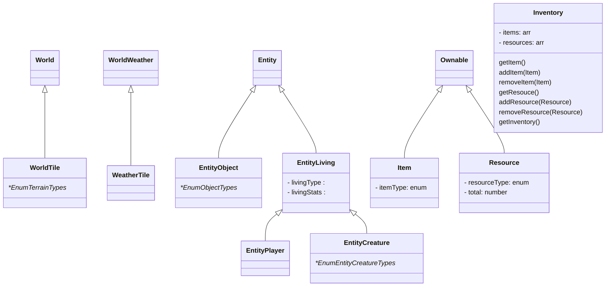

# exothium-world
Exothium World Game Repository

# Game Spec
#exothium #ExoWorld #spec 

## #todo
 - [ ] create diagram of relationships
 - [ ] falta definir totalmente:
	 - [ ] EntityLiving 
	 - [ ] Loot
 - [ ] stats that entityLiving will need

## Classes

- World 
- WorldTile
- WorldWeather
- WeatherTile
- Entity
	- EntityObject
	- EntityLiving
		- EntityPlayer
		- EntityCreature
- Interaction
- Ownable
	- item
	- resource
- Loot

- World 
- WorldTile
- WorldWeather
- WeatherTile
- Entity
	- EntityObject
	- EntityLiving
		- EntityPlayer
		- EntityCreature
- Interaction
- Ownable
	- item
	- resource
- Loot

## Enums
- TerrainType
- TerrainSubType
    - values that a tile can have to describe the biome subtype
- TerrainHeight
    - to get the tiles for the heights. If LAND then we generate new tiles for LAND. Beach is treated as Desert for now.
- NoiseHeight
- NoiseLand
- ObjectType
- LivingType
- CreatureType
- ItemsType
- ResourceType

### TerrainType:
        DESERT = 'desert',
        PLAIN = 'plain',
        FOREST = 'forest',
        SNOW = 'snow',
        MOUNTAIN = 'mountain',
        WATER = 'water',
        
### TerrainSubType: 

        DEEPWATER = 'deep water',
        SHALLOWWATER = 'shallow water',
        BEACH = 'beach',
        DESERT = 'desert',
        PLAIN = 'plain',
        FOREST = 'forest',
        SNOW = 'snow',
        MOUNTAIN = 'mountain',

### TerrainHeight:

        DEEPWATER = 'deepWater',
        SHALLOWWATER = 'shallowWater',
        BEACH = 'beach',
        LAND = 'land',
        MOUNTAIN = 'mountain',
    
### NoiseHeight:
    
        [TerrainHeight.DEEPWATER] : TerrainStruct,
        [TerrainHeight.SHALLOWWATER]: TerrainStruct,
        [TerrainHeight.BEACH]: TerrainStruct, //treated as desert
        [TerrainHeight.LAND]: TerrainStruct,
        [TerrainHeight.MOUNTAIN]: TerrainStruct,

### NoiseLand:

        [TerrainType.DESERT]: TerrainStruct,
        [TerrainType.PLAIN]: TerrainStruct,
        [TerrainType.FOREST]: TerrainStruct,
        [TerrainType.SNOW]: TerrainStruct,
        [TerrainType.MOUNTAIN]: TerrainStruct,

### ObjectType:

        BUSH = 'bush',
        TREE = 'tree',
        LOOSESTONE = 'loose stone',
        STONENODE = 'stone node',
        FLINTNODE = 'flint node'

### LivingType:

        PLAYER = 'player',
        CREATURE = 'creature',

### CreatureTypes:

        WOLF = 'wolf',
        RAM = 'ram',
        BEAR = 'bear',
        HYENA = 'hyena',
        GIANTWORM = 'giant worm',
        RABBIT = 'rabbit',
        DEER = 'deer',
        SNAKE = 'snake',
        BOAR = 'boar',
        SALMON = 'salmon',
        SIMPLEFISH = 'simple fish'
        
### OwnableType 

        ITEM = 'item',
        RESOURCE = 'resource',

### ItemType:

        AXE = 'axe',
        PICKAXE = 'pickaxe',
        SPEAR = 'spear',
        FISHINGSPEAR = 'fishing spear',
        KNIFE = 'knife',
        BEDROLL = 'bedroll',
        FLINTSPEAR = 'flint spear',
        FLINTKNIFE = 'flint knife',

### ResourceType:

        MEAT = 'meat',
        FISH = 'fish',
        BERRY = 'berry',
        STONE = 'stone',
        FLINT = 'flint',
        WOOD = 'wood',
        SKIN = 'skin'

#### Notes:
Doubts:
using 1 felt for 2 integers

Ideas:
anyone can attack with a creature, if kills the player the game will collect their resources (spoils of war)

## Classes:

### World
|      name        |      type           |      params           |      return           | 
| ------------ | --------------- |--------------- |--------------- |
| _worldSeed | string |
| _worldRadius | number |
| _numberOfRings | number |
| _landSize | number |
| _shapeNoiseMod | number |
| _tileTypeNoiseMod | number |
| _noiseHeight | <NoiseHeight> |
| __noiseLand | <NoiseLand> |

### WorldTile
|      name        |      type           |      params           |      return           | 
| ------------ | --------------- |--------------- |--------------- |
| type | `terrain` |
| entityCreatures| arr[`EntityCreature`] | 
| entityObjects | arr[`EntityObject`] | 

### WorldWeather
|      name        |      type           |      params           |      return           | 
| ------------ | --------------- |--------------- |--------------- |
| weatherSeed | int256 |
| radius | int256 |
| getWeatherTile | function | [q,r] | `WeatherTile`

### WeatherTile
|      name        |      type           |      params           |      return           | 
| ------------ | --------------- |--------------- |--------------- |
| clouds | int [0->1] | 
| preasure | int [-1 -> -1] | 
| wind | int  [angle] | 
| temperature | int  [-50 -> 50] | 

### Entity ⚠️
|      name        |      type           |      params           |      return           | 
| ------------ | --------------- |--------------- |--------------- |
| _name | string |
| _isInteractive | boolean |
| _isInGame | boolean |
| interactions | arr[`Interaction`] | 
| interact | interactions["action"] | 

### EntityObject ⚠️
|      name        |      type           |      params           |      return           | 
| ------------ | --------------- |--------------- |--------------- |
| type | `objectType` |

### EntityLiving ⚠️
|      name        |      type           |      params           |      return           | 
| ------------ | --------------- |--------------- |--------------- |
| type | `LivingType` |
| stats | `Stats` |

### EntityPlayer ⚠️
|      name        |      type           |      params           |      return           | 
| ------------ | --------------- |--------------- |--------------- |
| items | arr[`Item`] |
| stats | `Stats` |

### EntityCreature ⚠️
|      name        |      type           |      params           |      return           | 
| ------------ | --------------- |--------------- |--------------- |
| type | `creatureType` |
| loot | `Loot` |

### Loot 
|      name        |      type           |      params           |      return           | 
| ------------ | --------------- |--------------- |--------------- |
| items | arr[`Item`] |

### Ownable
|      name        |      type           |      params           |      return           | 
| ------------ | --------------- |--------------- |--------------- |
| name | string |
| owned | `Owner` |

### Item
|      name        |      type           |      params           |      return           | 
| ------------ | --------------- |--------------- |--------------- |
| souldbound | bool |
| consumable | bool |
| equipable | bool |
| effectOnComsume | ==statsEffect== |
| **(TBD)** effectOnEquip | ==statsEffectBonus== |

### ItemMinter
|      name        |      type           |      params           |      return           | 
| ------------ | --------------- |--------------- |--------------- |
| item | `Item` |
| min_drop | int |
| max_drop | int |
| drop | function | int | arr[`Item`] |

### Stats
|      name        |      type           |    
| ------------ | --------------- |
| hp | int  [0 -> 100] |
| st | int  [0 -> 100] |
| hn | int  [0 -> 100] |

### Interaction
|      name        |      type           |      params           |      return           | 
| ------------ | --------------- |--------------- |--------------- |
| name | string |
| source | `EntityLiving` |
| sourceRequiredItems | arr[`Item`] |
| sourceRequiredStats | stats |
| sourceEffects | ==statsEffect== |
| targetEntity | `Entity |
| targetEffects | ==statsEffect== |
| castTime | int(%day) |
| successRate | int(%) |
| distanceRange | int (dist in tiles) |
| castTime | int(%day) |
| successRate | int(%) |
| itemMinter | `ItemMinter` |

#### Notes:
statRequirement:
Example -> st - 30 > 0

`EntityLiving` can do `interaction` on `entity`?
`EntityLiving` have the `requirements` to do that?
yes
apply `entityEffects` on `EntityLiving`
apply `targetEffects` on `Entity`
done
