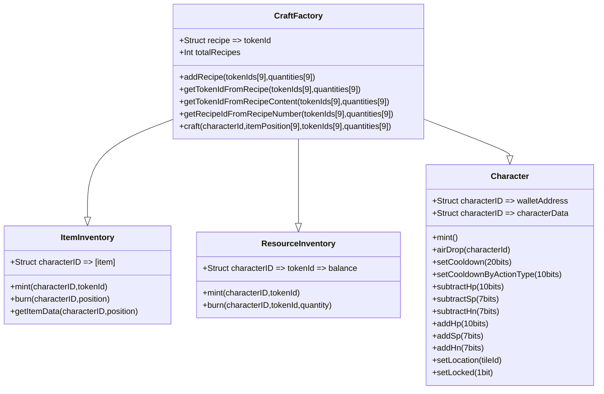
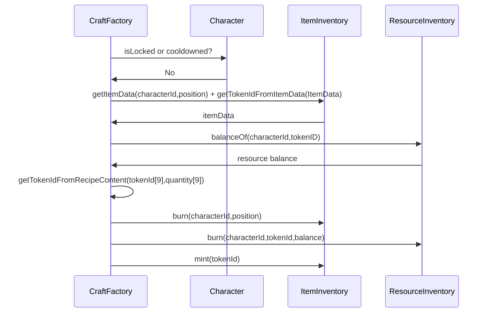

```mermaid
classDiagram

CraftFactory --|> ItemInventory

CraftFactory --|> ResourceInventory

CraftFactory --|> Character

CraftFactory : +Struct recipe => tokenId

CraftFactory : +Int totalRecipes

CraftFactory : +addRecipe(tokenIds[9],quantities[9])
CraftFactory : +getTokenIdFromRecipe(tokenIds[9],quantities[9])
CraftFactory : +getTokenIdFromRecipeContent(tokenIds[9],quantities[9])
CraftFactory : +getRecipeIdFromRecipeNumber(tokenIds[9],quantities[9])
CraftFactory : +craft(characterId,itemPosition[9],tokenIds[9],quantities[9])


  

class ResourceInventory{

  

+Struct characterID => tokenId => balance

  

+mint(characterID,tokenId)

  

+burn(characterID,tokenId,quantity)

  

}

class ItemInventory{

  

+Struct characterID => [item]
+mint(characterID,tokenId)
+burn(characterID,position)
+getItemData(characterID,position)
  
}

  

class Character{

+Struct characterID => walletAddress

+Struct characterID => characterData

+mint()

+airDrop(characterId)

+setCooldown(20bits)

+setCooldownByActionType(10bits)

+subtractHp(10bits)

+subtractSp(7bits)

+subtractHn(7bits)

+addHp(10bits)

+addSp(7bits)

+addHn(7bits)
+setLocation(tileId)
+setLocked(1bit)

}
```

##### Craft
- characterId
- itemPositions[9]
- tokenIds[9]
- quantities[9]

```mermaid
sequenceDiagram
	CraftFactory ->> Character: isLocked or cooldowned?
	Character ->> CraftFactory: No
	CraftFactory ->> ItemInventory: getItemData(characterId,position) + getTokenIdFromItemData(ItemData)
	ItemInventory ->> CraftFactory: itemData
	CraftFactory ->> ResourceInventory: balanceOf(characterId,tokenID)
	ResourceInventory ->> CraftFactory: resource balance
	CraftFactory ->> CraftFactory: getTokenIdFromRecipeContent(tokenId[9],quantity[9])
	CraftFactory ->> ItemInventory: burn(characterId,position)
	CraftFactory ->> ResourceInventory: burn(characterId,tokenId,balance)
	CraftFactory ->> ItemInventory: mint(tokenId)
	
```