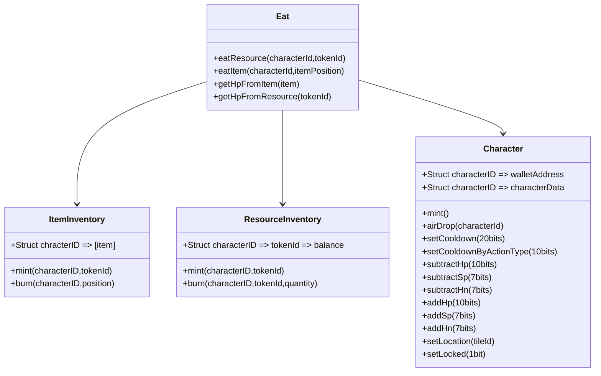
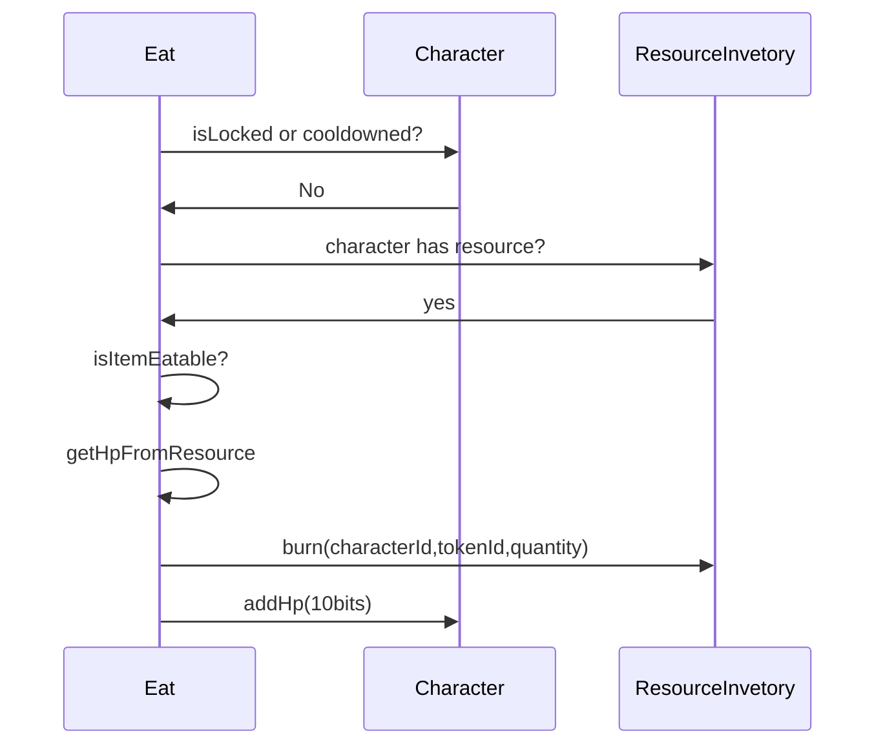

#### Eat

```mermaid
classDiagram

  

Eat --> ItemInventory

  

Eat --> ResourceInventory

  

Eat --> Character

  

class Eat{

  

+eatResource(characterId,tokenId)

  

+eatItem(characterId,itemPosition)

+getHpFromItem(item)
+getHpFromResource(tokenId)
  

}

  


  

Character : +Struct characterID => walletAddress

  

Character : +Struct characterID => characterData

  

Character : +mint()

  

Character : +airDrop(characterId)

  

Character : +setCooldown(20bits)

  

Character : +setCooldownByActionType(10bits)

  

Character : +subtractHp(10bits)

  

Character : +subtractSp(7bits)

  

Character : +subtractHn(7bits)

  

Character : +addHp(10bits)

  

Character : +addSp(7bits)

  

Character : +addHn(7bits)

  

Character : +setLocation(tileId)
Character : +setLocked(1bit)

  

class ResourceInventory{

  

+Struct characterID => tokenId => balance

  

+mint(characterID,tokenId)

  

+burn(characterID,tokenId,quantity)

  

}

  

class ItemInventory{

  

+Struct chracterID => [item]

  

+mint(characterID,tokenId)

  

+burn(characterID,position)

  

}
```
##### eatResource
- characterId
- tokenId

```mermaid
sequenceDiagram
Eat ->> Character: isLocked or cooldowned?
Character ->> Eat: No
Eat ->> ResourceInvetory: character has resource?
ResourceInvetory ->> Eat: yes
Eat ->> Eat: isItemEatable?
Eat ->> Eat: getHpFromResource
Eat ->> ResourceInvetory: burn(characterId,tokenId,quantity)
Eat ->> Character: addHp(10bits)
```

##### eatItem
- characterId
- itemPosition

```mermaid
sequenceDiagram
Eat ->> Character: isLocked or cooldowned?
Character ->> Eat: No
Eat ->> ItemInvetory: character has item at position?
ItemInvetory ->> Eat: yes
Eat ->> Eat: isItemEatable?
Eat ->> Eat: getHpFromItem
Eat ->> ItemInvetory: burn(tokenId,characterId,quantity)
Eat ->> Character: addHp(10bits)
```

