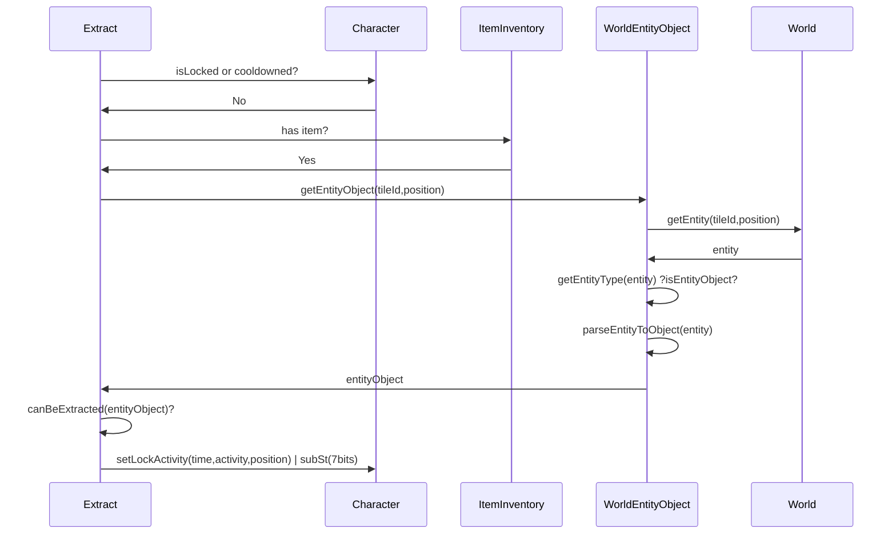
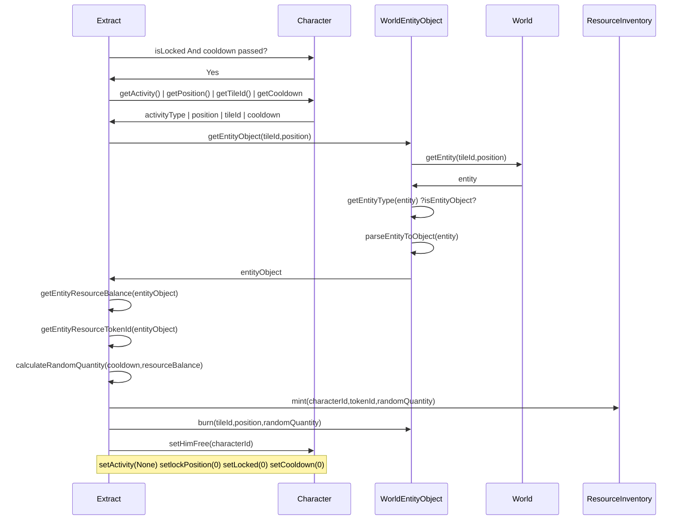

```mermaid
classDiagram

Extract --> Character

Extract --> ItemInventory

Extract --> WorldEntityObject

Extract --> ResourceInventory

Extract .. World

class Extract{
(harvest,chop,mine,fish)
+startExtract(characterId,itemPosition,worldEntityObjectPosition)
+finishExtract(characterId,worldEntityObjectPosition)
+canExtract(entityObject)
+getEntityResourceBalance(entityObject)
+getEntityResourceTokenId(entityObject)
+getRandomQuantity(cooldown,resourceBalance)

}

Character .. World

Character : +Struct characterID => walletAddress

Character : +Struct characterID => characterData

Character : +mint()

Character : +airDrop(characterId)

Character : +setLockPosition(20bits)

Character : +setCooldown(20bits)

Character : +setCooldownByActivityType(10bits)

Character : +subHp(10bits)

Character : +subSp(7bits)

Character : +subHn(7bits)

Character : +addHp(10bits)

Character : +addSp(7bits)

Character : +addHn(7bits)

Character : +setLocation(tileId)
Character : +setLock(1bit)
Character : +setLockActivity(activityType,time,position)
Character : +setHimFree()

class ResourceInventory{

  

+Struct characterID => tokenId => balance

  

+mint(characterID,tokenId)

  

+burn(characterID,tokenId,quantity)

  

}

class ItemInventory{

  

+Struct chracterID => [item]

  

+mint(characterID,tokenId)

  

+burn(characterID,position)

  

}

  
  
  

class World{

+Struct tileId => tile

+Struct tileId => [entity]
+getEntity(tileId,position)
}

WorldEntityObject --> World

class WorldEntityObject{

+mint(tileId,EntityObjectType)

+burn(tileId,position,quantity)

+getEntityObject(tileId,position)

}
```

##### startExtract

- characterId
- itemPosition
- entityObjectPosition




##### finishExtract

- characterId


