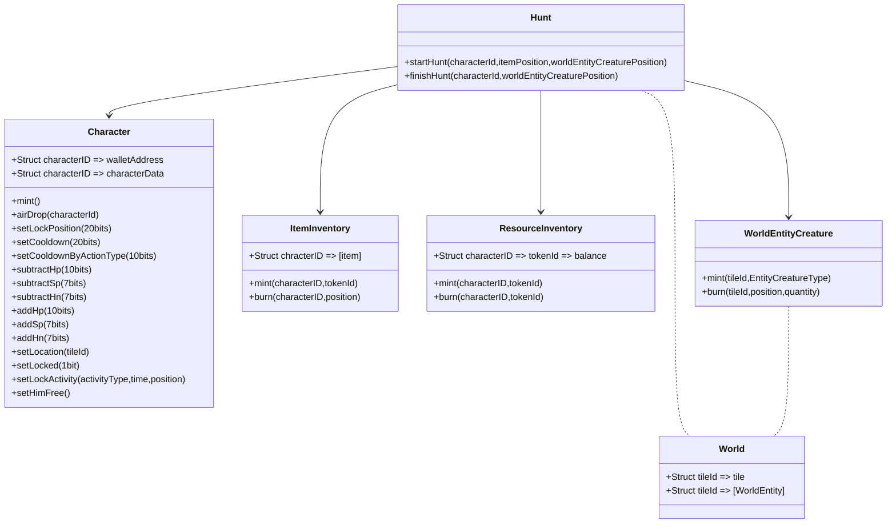
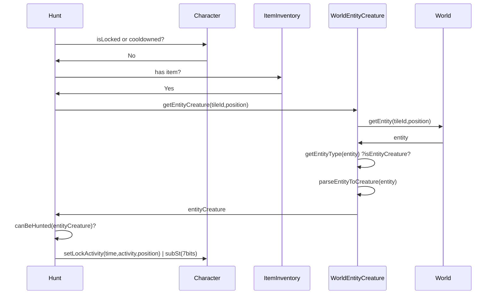
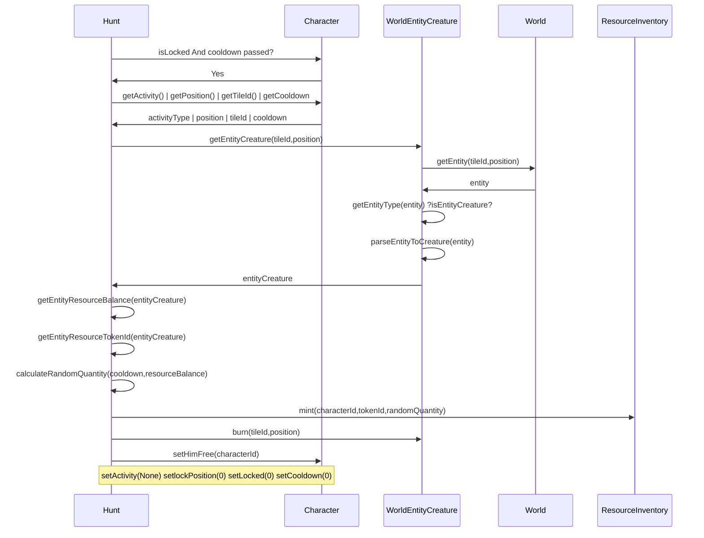

#### Hunt

```mermaid
classDiagram

Hunt --> Character

Hunt --> ItemInventory

Hunt --> ResourceInventory

Hunt --> WorldEntityCreature

Hunt .. World

class Hunt{

+startHunt(characterId,itemPosition,worldEntityCreaturePosition)
+finishHunt(characterId,worldEntityCreaturePosition)

}

  

Character : +Struct characterID => walletAddress

Character : +Struct characterID => characterData

Character : +mint()

Character : +airDrop(characterId)

Character : +setLockPosition(20bits)

Character : +setCooldown(20bits)

Character : +setCooldownByActionType(10bits)

Character : +subtractHp(10bits)

Character : +subtractSp(7bits)

Character : +subtractHn(7bits)

Character : +addHp(10bits)

Character : +addSp(7bits)

Character : +addHn(7bits)

Character : +setLocation(tileId)
Character : +setLocked(1bit)
Character : +setLockActivity(activityType,time,position)
Character : +setHimFree()

class ResourceInventory{

  

+Struct characterID => tokenId => balance

  

+mint(characterID,tokenId)

  

+burn(characterID,tokenId)

  

}

class ItemInventory{

  

+Struct chracterID => [item]

  

+mint(characterID,tokenId)

  

+burn(characterID,position)

  

}

  

class World{

+Struct tileId => tile

+Struct tileId => [WorldEntity]

}

  

WorldEntityCreature .. World

class WorldEntityCreature{

+mint(tileId,EntityCreatureType)

+burn(tileId,position,quantity)

}
```

##### startHunt

- characterId
- itemPosition
- entityCreaturePosition

```mermaid
sequenceDiagram

Hunt ->> Character: isLocked or cooldowned?
Character ->> Hunt: No
Hunt ->> ItemInventory: has item?
ItemInventory ->> Hunt: Yes
Hunt ->> WorldEntityCreature: getEntityCreature(tileId,position)
WorldEntityCreature ->> World: getEntity(tileId,position)
World ->> WorldEntityCreature: entity
WorldEntityCreature ->> WorldEntityCreature: getEntityType(entity) ?isEntityCreature?
WorldEntityCreature ->> WorldEntityCreature: parseEntityToCreature(entity)
WorldEntityCreature ->> Hunt: entityCreature
Hunt ->> Hunt: canBeHunted(entityCreature)?
Hunt ->> Character: setLockActivity(time,activity,position) | subSt(7bits) 

```

##### finishHunt

- characterId

```mermaid
sequenceDiagram

Hunt ->> Character: isLocked And cooldown passed?
Character ->> Hunt: Yes
Hunt ->> Character: getActivity() | getPosition() | getTileId() | getCooldown
Character ->> Hunt: activityType | position | tileId | cooldown
Hunt ->> WorldEntityCreature: getEntityCreature(tileId,position)
WorldEntityCreature ->> World: getEntity(tileId,position)
World ->> WorldEntityCreature: entity
WorldEntityCreature ->> WorldEntityCreature: getEntityType(entity) ?isEntityCreature?
WorldEntityCreature ->> WorldEntityCreature: parseEntityToCreature(entity)
WorldEntityCreature ->> Hunt: entityCreature
Hunt ->> Hunt: getEntityResourceBalance(entityCreature)
Hunt ->> Hunt: getEntityResourceTokenId(entityCreature)
Hunt ->> Hunt: calculateRandomQuantity(cooldown,resourceBalance)
Hunt ->> ResourceInventory: mint(characterId,tokenId,randomQuantity)
Hunt ->> WorldEntityCreature: burn(tileId,position)
Hunt ->> Character: setHimFree(characterId) 
Note over Hunt,Character: setActivity(None) setlockPosition(0) setLocked(0) setCooldown(0)
```
