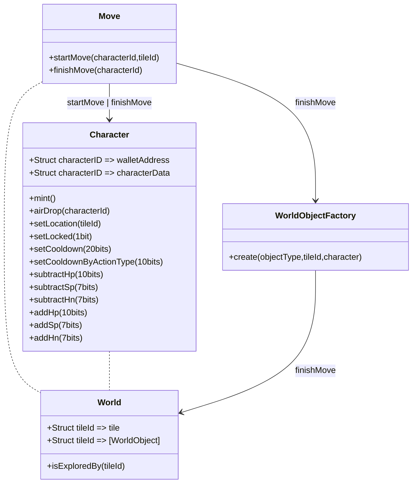
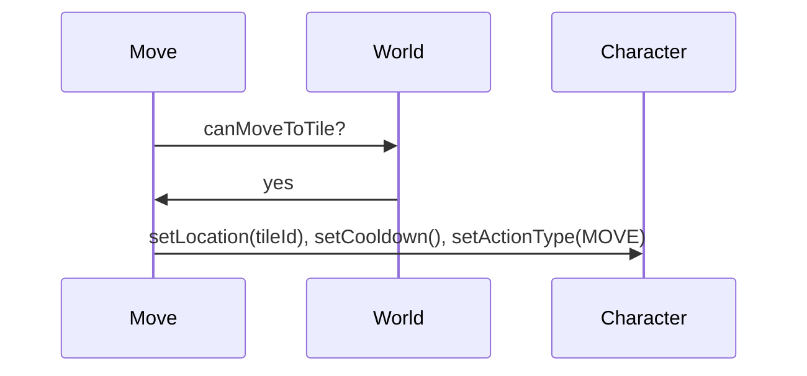
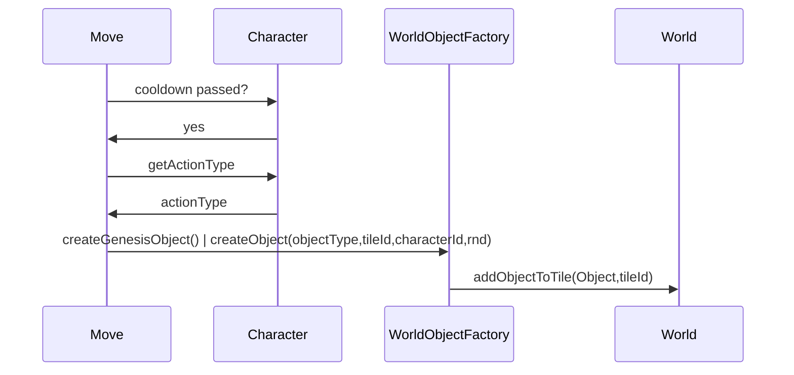

#### Move Contract interactions

```mermaid
classDiagram

Move .. World
Move --> WorldObjectFactory : finishMove
Move --> Character : startMove | finishMove

class Move{

+startMove(characterId,tileId)
+finishMove(characterId)
}

Character .. World
Character : +Struct characterID => walletAddress
Character : +Struct characterID => characterData
Character : +mint()
Character : +airDrop(characterId)
Character : +setLocation(tileId)
Character : +setLocked(1bit)
Character : +setCooldown(20bits)
Character : +setCooldownByActionType(10bits)
Character : +subtractHp(10bits)
Character : +subtractSp(7bits)
Character : +subtractHn(7bits)
Character : +addHp(10bits)
Character : +addSp(7bits)
Character : +addHn(7bits)

class World{
+Struct tileId => tile
+Struct tileId => [WorldObject]
+isExploredBy(tileId)
}
WorldObjectFactory --> World : finishMove
class WorldObjectFactory{
+create(objectType,tileId,character)
}
```

##### startMove
- characterId
- tileId

```mermaid
sequenceDiagram

Move ->> World: canMoveToTile?
World ->> Move: yes
Move ->> Character: setLocation(tileId), setCooldown(), setActionType(MOVE)
```

##### finishMove
- characterId

```mermaid
sequenceDiagram

Move ->> Character: cooldown passed?
Character ->> Move: yes
Move ->> Character: getActionType
Character ->> Move: actionType
Move ->> WorldObjectFactory: createGenesisObject() | createObject(objectType,tileId,characterId,rnd)
WorldObjectFactory ->> World: addObjectToTile(Object,tileId)
```
