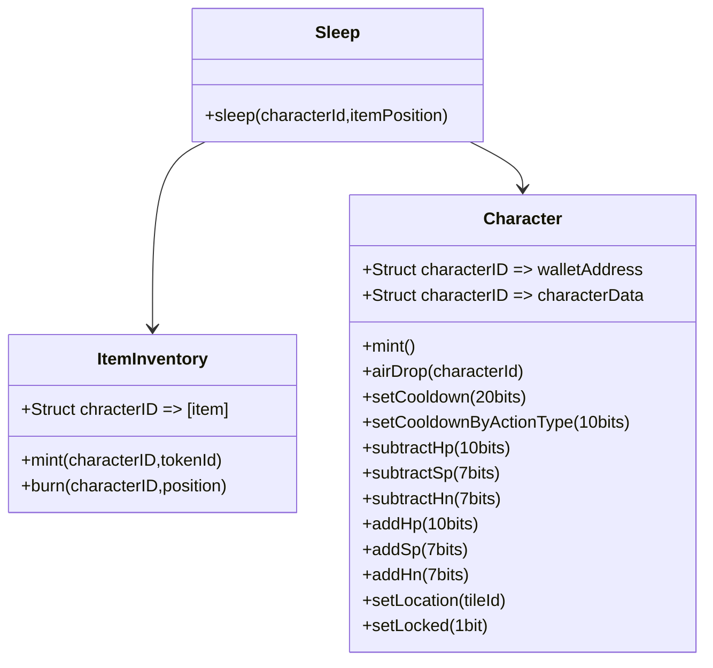
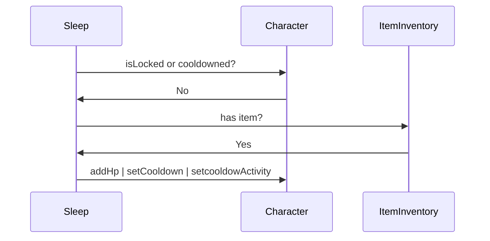

#### Sleep

```mermaid
classDiagram

  

Sleep --> ItemInventory

Sleep -->Character


class Sleep{

  

+sleep(characterId,itemPosition)

  

}

  

  

Character : +Struct characterID => walletAddress

  

Character : +Struct characterID => characterData

  

Character : +mint()

  

Character : +airDrop(characterId)

  

Character : +setCooldown(20bits)

  

Character : +setCooldownByActionType(10bits)

  

Character : +subtractHp(10bits)

  

Character : +subtractSp(7bits)

  

Character : +subtractHn(7bits)

  

Character : +addHp(10bits)

  

Character : +addSp(7bits)

  

Character : +addHn(7bits)

  

Character : +setLocation(tileId)
Character : +setLocked(1bit)

  


  

  

class ItemInventory{

  

+Struct chracterID => [item]

  

+mint(characterID,tokenId)

  

+burn(characterID,position)

  

}
```

##### sleep
- characterId
- itemPosition

```mermaid
sequenceDiagram

	Sleep ->> Character: isLocked or cooldowned?
	Character ->> Sleep: No
	Sleep ->> ItemInventory: has item?
	ItemInventory ->> Sleep: Yes
	Sleep ->> Character: addHp | setCooldown | setcooldowActivity

```

